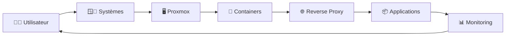
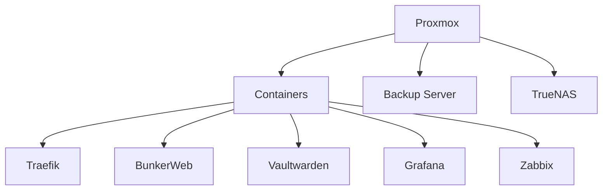

# 🖥️ Wiki Informatique

> 🎯 *Centre de connaissances – Systèmes, Virtualisation & Containerisation*

---

## 🚀 Accès rapide

| 🪟 Systèmes                | 🖥️ Virtualisation | 🐳 Containers        | 📊 Monitoring  | 🔐 Sécurité          |
| -------------------------- | ------------------ | -------------------- | -------------- | -------------------- |
| [[Administration Windows]] | [[Proxmox]]        | [[Containerisation]] | [[Monitoring]] | [[Sécurité]]         |
| [[Administration Linux]]   | [[Stockage]]       | [[Reverse Proxy]]    | [[Logs]]       | [[Authentification]] |

---

## 🧭 Vue d’ensemble

---

## 🪟🐧 Systèmes

> Administration et gestion des environnements Windows & Linux

| 🔧 Domaine       | 📌 Contenu                          |
| ---------------- | ----------------------------------- |
| Active Directory | GPO, LDAP, DNS, DHCP                |
| Windows Server   | Administration, sécurité, scripting |
| Linux            | Debian, services, sécurité          |
| Automatisation   | PowerShell, Bash                    |

➡️ [[Administration Windows]]
➡️ [[Administration Linux]]

---

## 🖥️ Virtualisation (Proxmox)

> Infrastructure et gestion des ressources

| ⚙️ Élément  | 📌 Contenu            |
| ----------- | --------------------- |
| Hyperviseur | Installation, cluster |
| Stockage    | ZFS, NFS, PBS         |
| Réseau      | Bridge, VLAN          |
| VM / LXC    | Déploiement & gestion |

➡️ [[Proxmox]]
➡️ [[Stockage]]

---

## 🐳 Containerisation

> Déploiement d’applications modernes

| 📦 Outils       | 📌 Usage             |
| --------------- | -------------------- |
| Docker / Podman | Conteneurs           |
| Compose         | Orchestration simple |
| Portainer       | Gestion UI           |
| Images          | Build & registry     |

➡️ [[Containerisation]]

---

## 🌐 Reverse Proxy & Accès

> Exposition sécurisée des services

| 🔧 Outil  | 📌 Fonction             |
| --------- | ----------------------- |
| Traefik   | Reverse proxy dynamique |
| BunkerWeb | WAF & sécurité          |
| TLS / PKI | Certificats             |

➡️ [[Reverse Proxy]]

---

## 📊 Monitoring & Logs

> Supervision et analyse

| 📈 Outil   | 📌 Fonction    |
| ---------- | -------------- |
| Grafana    | Visualisation  |
| Prometheus | Metrics        |
| Zabbix     | Supervision    |
| Logs       | Centralisation |

➡️ [[Monitoring]]
➡️ [[Logs]]

---

## 🔐 Sécurité & Authentification

> Protection des systèmes et des accès

| 🔒 Domaine       | 📌 Contenu       |
| ---------------- | ---------------- |
| Authentification | LDAP, OIDC, SSO  |
| Accès            | Authelia         |
| Secrets          | Vaultwarden      |
| Hardening        | Bonnes pratiques |

➡️ [[Sécurité]]
➡️ [[Authentification]]

---

## 🧰 Stack utilisée

---

## ⚡ Bonnes pratiques

* 🔄 Maintenir les systèmes à jour
* 🔐 Sécuriser les accès (SSO, MFA)
* 📦 Standardiser les déploiements
* 🧪 Tester en pré-production
* 💾 Mettre en place des sauvegardes fiables

➡️ [[Bonnes pratiques]]

---

## 📌 Navigation rapide

* 📁 [[Proxmox]]
* 📁 [[Containerisation]]
* 📁 [[Reverse Proxy]]
* 📁 [[Monitoring]]
* 📁 [[Sécurité]]

---

## 📝 À propos

> Ce wiki est conçu comme un **hub central de connaissances IT**, permettant de :

* 📚 Documenter les procédures
* ⚙️ Standardiser les configurations
* 🚀 Accélérer les déploiements
* 🧠 Capitaliser sur l’expérience

